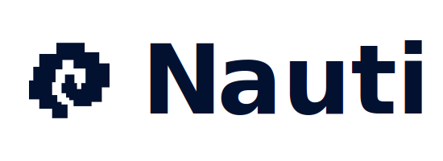

# Nauti

<div align="left">
  
</div>

Nauti is a unique on-chain content platform that provides an alternative way to curate, showcase and consume content. Taking cue from nautilus's golden spiral, Nauti presents an infinite amount of content with a fresh and dynamic layout that invites creativity.

###### © 2025 Nauti • BUSL-1.1 License

## Website

Deployed at [Nauti](https://nauti.space)

## Demo Videos

-   [Nauti Demo for Mammothon](https://youtu.be/imWkt2mfGsc)

## Key Features

-   **Dynamic Content Layout**

    -   Unique golden spiral-based infinite content layout
    -   Interactive zoom and navigation system
    -   Seamless content loading and rendering
    -   Responsive design adapting to all screen sizes
    -   Full-screen content page viewing

-   **On-Chain Content Platform**

    -   ERC-721 NFT-based content ownership
    -   On-chain HTML content storage
    -   Metadata management with upgradeable contracts
    -   IPFS integration for image storage
    -   Real-time content preview and updating

-   **Smart Contract Architecture**

    -   Upgradeable smart contracts (UUPS pattern)
    -   Separate metadata and content management
    -   Secure ownership and transfer mechanisms
    -   Efficient on-chain storage optimization

-   **Developer Features**

    -   Modern Next.js 13 App Router
    -   Type-safe development with TypeScript
    -   Efficient state management
    -   Comprehensive testing suite

## Conduit Deployment

Nauti utilizes Conduit (G2 Testnet) for optimized contract deployment and management:

-   **Smart Contract Infrastructure**

    -   Deployed on Conduit's L2 infrastructure
    -   Reduced gas costs and faster transactions
    -   Enhanced scalability for content storage
    -   Optimized for frequent metadata updates

-   **Contract Upgrades**

    -   UUPS (Universal Upgradeable Proxy Standard) pattern
    -   Seamless contract upgrades via Conduit
    -   Maintains state while improving functionality
    -   Zero downtime during upgrades

-   **Integration Benefits**
    -   Automated deployment pipelines
    -   Built-in contract verification
    -   Simplified cross-chain deployment

## 📚 Technical Documentation

-   **Frontend**

    -   Next.js 13 (App Router)
    -   TypeScript
    -   Tailwind CSS
    -   shadcn/ui components
    -   Web3 Integration: wagmi/viem

-   **Smart Contracts**
    -   Hardhat
    -   Solidity
    -   Ethereum

## 📋 Prerequisites

-   [Node.js](https://nodejs.org/) (v18 or higher)
-   [pnpm](https://pnpm.io/) (v8 or higher)
-   [Git](https://git-scm.com/)

## 🚀 Getting Started

1. Clone the repository:

```bash
git clone https://github.com/sebajunnn/nauti.git
cd nauti
```

2. Install dependencies:

```bash
pnpm install
```

3. Set up your environment variables:

```bash
cp packages/nextjs/.env.template packages/nextjs/.env.local

NEXT_PUBLIC_PINATA_API_KEY=your_pinata_api_key_here
NEXT_PUBLIC_PINATA_API_SECRET=your_pinata_api_secret_here
```

4. Start the development environment:

```bash
# Start the local blockchain
pnpm chain

# In a new terminal, start the frontend
pnpm dev
```

The application will be available at [http://localhost:3000](http://localhost:3000)

## 📁 Project Structure

```
nauti/
├── packages/
│   ├── nextjs/                # Frontend application
│   │   ├── app/              # Next.js 13 app directory
│   │   ├── components/       # React components
│   │   ├── hooks/           # Custom React hooks
│   │   ├── services/        # API services
│   │   ├── stores/          # State management
│   │   ├── utils/           # Utility functions
│   │   └── types/           # TypeScript types
│   │
│   └── contracts/           # Smart contract development
├── design/                  # Design assets and resources
├── pnpm-workspace.yaml     # Workspace configuration
└── package.json           # Root package.json
```

## 🔧 Available Scripts

-   `pnpm dev` - Start the frontend development server
-   `pnpm build` - Build the frontend for production
-   `pnpm start` - Start the production server
-   `pnpm chain` - Start the local blockchain
-   `pnpm deploy` - Deploy smart contracts

## 📄 License

This project is licensed under the **Business Source License 1.1 (BUSL-1.1)**:

-   **Non-Commercial Use**: Free for personal, academic, and non-commercial projects
-   **Commercial Use**: Requires explicit permission from the copyright holders
-   **Change Date**: On March 1, 2028, this project will transition to the Apache-2.0 license
-   **Contact**: For commercial licensing inquiries, please contact Seb @ sebajun404@yahoo.com

See the [LICENSE](./LICENSE) file for full terms.

## 🙏 Acknowledgments

-   [Scaffold-ETH 2](https://github.com/scaffold-eth/scaffold-eth-2)
-   [shadcn/ui](https://ui.shadcn.com/)
-   [wagmi](https://wagmi.sh/)
